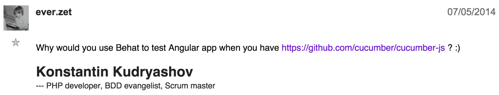
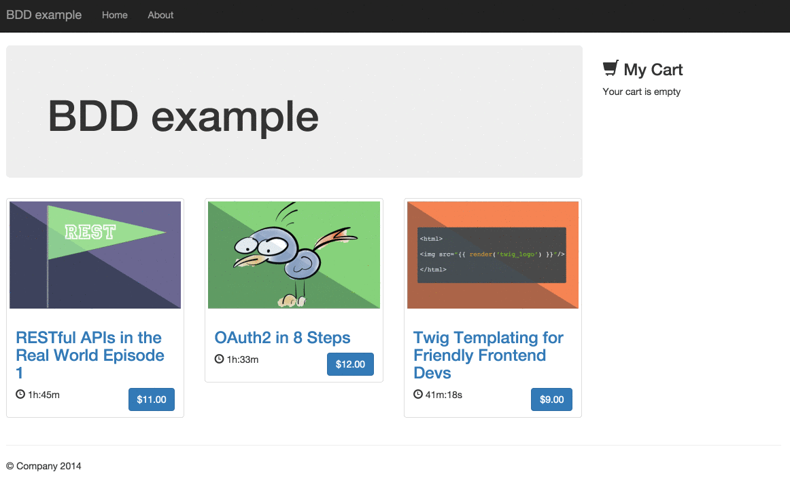
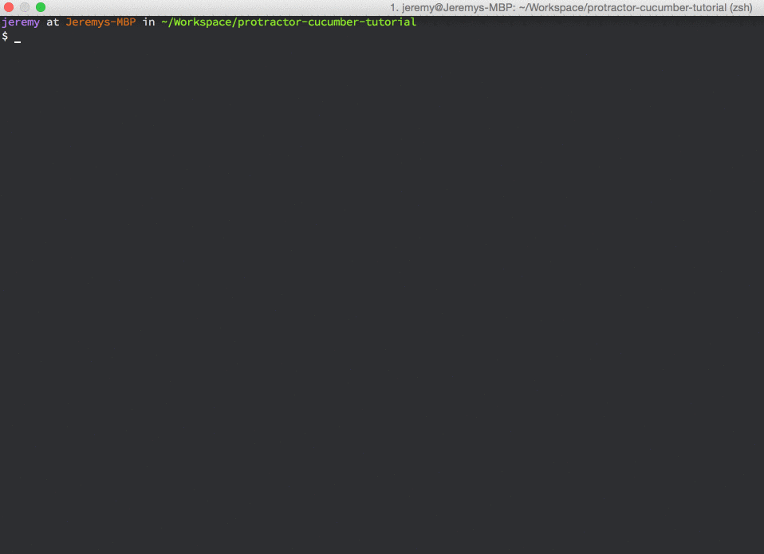

BDD & Javascript
================

#### especially for "Single Page Application"

<!-- .element: class="small" -->
[KNP Labs][knplabs] - January 2015 - created by [Jeremy Barthe][site]

[knplabs]: http://knplabs.com/
[site]: http://jeremybarthe.com/

---

## Behaviour Driven Development

- Describe Business Values (as User Stories)
- Based on a structured language named Gherkin

It's not "Beer Driven Development" (&copy; Saša)
<!-- .element: class="fragment small" -->

---

## Which tool can we use for BDD?

**Of course, Behat ;-)**
<!-- .element: class="fragment" -->

---

## But what happen if you build an App mostly with Javascript?

#### A "Single Page Application" for example...
<!-- .element: class="fragment" -->

---

## First, what exactly is a "Single Page Application" (SPA)?

> A single-page application (SPA), is a web application (...) that fits on a 
> single web page with the goal of providing a more fluid user experience akin 
> to a desktop application.

Basically, it's a full App written in HTML, Javascript, and CSS.
<!-- .element: class="fragment" -->

---

## Single Page Application

- a Single Page Application needs BDD because it's in front of your clients
- it also means a complete separation between client and server (the API...)

#### For Symfony2 users:

- it means no presentation in your code, only for your API...
- it also means no more Twig...
- and no Assetic (haha)
- and a lot of new frameworks to learn ;-)

---

## So, BDD & a SPA?

#### Is Behat is the right tool for that?

- I think not...
<!-- .element: class="fragment" data-fragment-index="0" -->
- First, because it's difficult to know when the page is refreshed
<!-- .element: class="fragment" data-fragment-index="0" -->
- Also, if your App is written in Javascript, use Javascript tools...
<!-- .element: class="fragment" data-fragment-index="1" -->

---

### And everzet approve:

#### ;-)

---

## A SPA as example

#### I developed a SPA to introduce you:

- [AngularJS][angular] framework
- [Protractor][protractor] to execute tests
- [Cucumber.js][cucumber] to execute BDD scenarios
- Tests/assertions in Javascript

[Source code available on Github][github]

[angular]: https://angularjs.org/
[protractor]: http://www.protractortest.org
[cucumber]: https://github.com/cucumber/cucumber-js
[github]: https://github.com/jeremyb/protractor-cucumber-tutorial

---

## Screencast

<!-- .element: class="fullscreen" -->

---

## Introducing Protractor

- end-to-end test framework for AngularJS applications
- built on top of WebDriverJS (Selenium / PhantomJS)
- API to manipulate DOM (locators, actions, etc.)

    // find an element using a css selector
    by.css('.myclass')
    // find an element with the given id
    by.id('myid')
    // finding multiple elements
    element.all(by.css('.selector')).then(function(elements) {
        console.log(elements);
    });
    // click on the element
    element(by.css('my-css')).click();

- (equivalent to Mink)

---

## Introducing Cucumber.js

- Cucumber for the Javascript stack
- allow you to execute Gherkin Features
- you have to write step definitions in Javascript :-)
- (equivalent to Behat)

---

## Installation

`package.json`

    {
      "name": "protractor-cucumber-tutorial",
      "version": "0.1.0",
      "scripts": {
        "test": ""
      },
      "devDependencies": {
        "phantomjs": "latest",
        "protractor": "latest",
        "cucumber": "latest",
        "chai": "latest",
        "chai-as-promised": "latest"
      }
    }

---

## Scenarios (in Gherkin)

    Feature: Use the shopping cart
      In order to select products in my shopping cart
      As a visitor
      I want to be able to view products and add them to my shopping cart

      Scenario: Seeing empty cart
        Given I am on the homepage
        Then the sidebar with the summary cart should contains no items
        And I should see "Your cart is empty" in the sidebar

      Scenario: Adding a product to my shopping cart
        Given I am on the homepage
        Then I should see 3 products

      Scenario: Adding a product to my shopping cart
        Given I am on the homepage
        Then I follow the product link "OAuth2 in 8 Steps"
        Then I should see the product detail page
        And I click to the add to cart button
        Then I should see "OAuth2 in 8 Steps" in the sidebar

---

## Step definitions

- Neither Protractor nor Cucumber.js provide a   test framework / an assertion library
- In the next examples I will use Chai

---

## Step definitions example

    this.Then(/I should see "([^"]*)" in the sidebar$/, function(text, next) {
        expect(element(by.cssContainingText('#sidebar', text)).isPresent())
            .to.become(true)
            .and.notify(next);
    });

    this.Then(/I should see ([0-9]*) products/, function(count, next) {
        expect(element.all(by.repeater('product in catalog')))
            .to.eventually.have.length(count)
            .and.notify(next);
    });

---

## Step definitions example

    this.registerHandler('AfterScenario', function (event, callback) {
        // clear localStorage
        browser.executeScript('window.localStorage.clear();');
        callback();
    });

---

## Protractor config.js file

    exports.config = {
        baseUrl: 'http://localhost:3000', // URL of your App

        seleniumAddress: 'http://localhost:4444/wd/hub',
        capabilities: {
            browserName: 'phantomjs'
        },

        framework: 'cucumber',

        specs: [
            'public/components/shop/features/*.feature'
        ],

        cucumberOpts: {
            require: 'public/components/shop/features/stepDefinitions.js',
            format: 'pretty' // or summary
        }
    };

---

## Launch tests

    ./node_modules/protractor/bin/protractor config.js

(You have to launch Selenium or PhantomJS, and your server App)

---

<!-- .element: class="fullscreen" -->

---

## Thank You.

### Questions?

[jeremybarthe.com][site] - [Twitter][twitter] - [Github][github]

[site]: http://jeremybarthe.com/
[twitter]: https://twitter.com/jeremyb_
[github]: https://github.com/jeremyb
