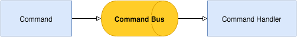
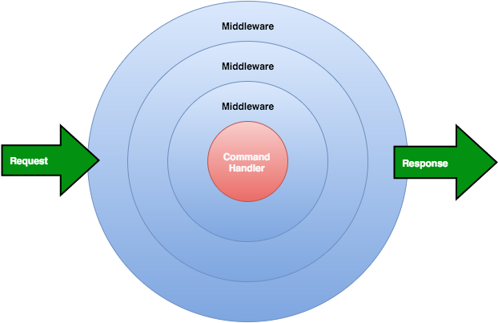
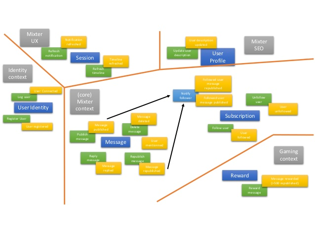

## Command Bus

#### Meetup After Work DDD - Mai 2016

<!-- .element: class="right" -->

#### [Jeremy Barthe][site]

[site]: http://jeremybarthe.com/
[talkspirit]: https://www.talkspirit.com/

---

## Situation

* Développeur Symfony depuis 2009
* MVC
  * Controller avec logique métier
  * Couplage entre l'action et la request HTTP
* ORM Doctrine
  * Modélisation en fonction de Doctrine
  * Couplage model / request HTTP (via les formulaires)

---

#### Syndrôme du "c'est un projet Symfony"...

---

### Evolution

[de Matthias Noback](https://leanpub.com/a-year-with-symfony)
<!-- .element: class="small" -->

---

### Form handlers

    class CreateAccountFormHandler
    {
        public function handle(FormInterface $form, Request $request)
        {
        }
    }

* permet d'extraire la logique métier du Controller
* toujours couplé à une request HTTP

---

### Domain managers

    class AccountManager
    {
        public function create(Account $account);
        public function update(Account $account);
        public function delete(Account $account);
    }

* classe un peu "fourre-tout"
* couplage avec Doctrine (EntityManager, Events)

---

### Evolution

* Toujours trop de couplage
  * avec la request HTTP (Forms)
  * avec la persistence (ORM / Database)
  * avec le modèle

---

### Evolution

* Manque de protection du modèle (couplage entre les couches)
* Manque un élément de communication entre le modèle et les couches extérieures (Form, CLI, API, etc.)

---

### Data Transfer Object (DTO)

* Un DTO a pour but de simplifier les échanges de données
* C'est un objet simpliste (POPO)

---

## Découverte du Command Bus

---

### Command

* Représente une action dans l'application
* N'est pas liée à une request HTTP, simplement des données (c'est un DTO)
* Elle peut être utilisée quelque soit le point d'entrée (Form, CLI, etc.)

---

### Exemple de Command

    final class RegisterUser
    {
        private $username;
        private $password;
        private $emailAddress;

        public function __construct(
            string $username,
            string $password,
            string $emailAddress
        ) {
            $this->username = $username;
            $this->password = $password;
            $this->emailAddress = $emailAddress;
        }
    }

---

### Exemple de Command

    use Symfony\Component\Validator\Constraints\Email;
    use Symfony\Component\Validator\Constraints\NotBlank;

    final class RegisterUser
    {
        /**
         * @NotBlank()
         */
        public $username;
        /**
         * @NotBlank()
         */
        public $password;
        /**
         * @NotBlank()
         * @Email()
         */
        public $emailAddress;
    }

---

### Handler

* Implémentation liée à la Command / à l'action
* Le traitement de la commande ne peut rien retourner
* Une action représente une écriture

---

### Exemple de Handler

    final class RegisterUserHandler
    {
        private $userRepository;
        private $passwordEncoder;

        // __construct($userRepository, $passwordEncoder)

        public function __invoke(RegisterUser $command)
        {
            $user = new User(
                $command->getUsername(),
                $this->passwordEncoder->encodePassword($command->getPassword()),
                $command->getEmail(),
            );

            $this->userRepository->add($user);
        }
    }

---

### Command Bus

* A la connaissance de toutes les Commands
* Trouve le Handler associé à une Command

---

#### Exemple d'utilisation d'un Command Bus

    $command = new RegisterUser('test', 'password', 'test@email.com');
    $commandBus->handle($command);

---

### Command Bus

* Peut aussi encapsuler des éléments d'infrastructure (transaction à la base de données, asynchrone, logs, etc.)

---

### Aller plus loin (lectures)

* [Hexagonal Architecture](http://fideloper.com/hexagonal-architecture)
* [A wave of command buses](http://php-and-symfony.matthiasnoback.nl/2015/01/a-wave-of-command-buses/)
* [Responsibilities of the command bus](http://php-and-symfony.matthiasnoback.nl/2015/01/responsibilities-of-the-command-bus/)
* [Some questions about the command bus](http://php-and-symfony.matthiasnoback.nl/2015/01/some-questions-about-the-command-bus/)
* [Command Buses Demystified: A Look at the Tactician Package](http://www.sitepoint.com/command-buses-demystified-a-look-at-the-tactician-package/)

---

### Aller plus loin (libraries)

* http://simplebus.github.io/MessageBus/
* http://tactician.thephpleague.com/
* https://laravel.com/docs/5.0/bus
* https://github.com/PHPMessageBus/messagebus

---

## Découverte des Domain Events

---

### Domain Events

* Une Command termine par un Event
* Nommage au passé (ex: UserRegistered)
* Parfait pour les tâches secondaires au Handler :
  * envoie d'email
  * statistiques
  * intéraction avec une API tierce

---

### Exemple de Domain Event

    final class RegisterUserHandler
    {
        private $recordsMessages;

        public function __invoke(RegisterUser $command)
        {
            // ...

            $event = new UserRegistered($user->getId());
            $this->recordsMessages->record($event);
        }
    }

---

### Exemple de Domain Event

    final class SendWelcomeMailWhenUserRegistered
    {
        // ...

        public function __invoke(UserRegistered $event)
        {
            $user = $this->userRepository->byId($event->userId());

            // send the welcome mail
        }
    }

* Exécutions peuvent être asynchrones

---

### Aller plus loin

* [From commands to events](http://php-and-symfony.matthiasnoback.nl/2015/01/from-commands-to-events/)
* [Collecting events and the event dispatching command bus](http://php-and-symfony.matthiasnoback.nl/2015/01/collecting-events-and-the-events-aware-command-bus/)
* http://simplebus.github.io/MessageBus/doc/event_bus.html

---

## Ubiquitous Language

* Langage commun entre le business et les développeurs
* Le code doit refléter le langage du métier, son vocabulaire, ses termes spécifiques, etc.

---

## Event Storming

* &lt;troll&gt;L'agilité enfin utile pour les développeurs ?&lt;/troll&gt; ;-)
* Faire émerger les événements (au passé)
  * ex: User registered, Invoice paid (= Domain Events)
* Origine de l'événement (l'action réalisée par un utilisateur ou par le système)
  * ex : Registration (= Command)

---

## Merci !

### Questions ?

[jeremybarthe.com][site] - [Twitter][twitter] - [Github][github]

[site]: http://jeremybarthe.com/
[twitter]: https://twitter.com/jeremyb_
[github]: https://github.com/jeremyb
