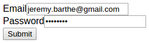
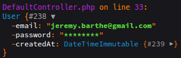
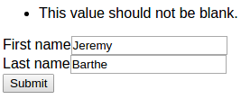
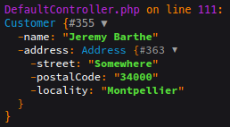
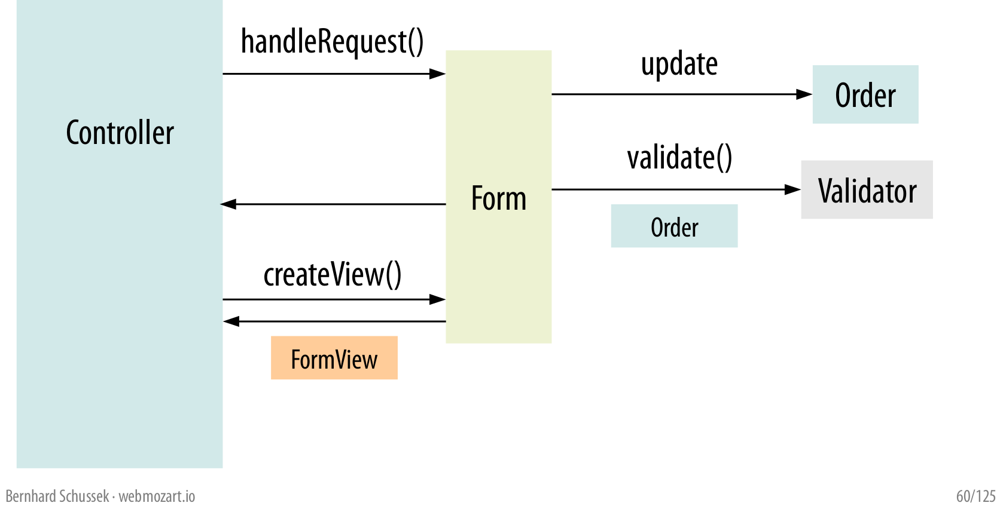
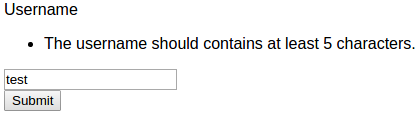

## Ne laissez pas les formulaires Symfony influencer votre modèle

#### Domain-Driven Design Day - Lyon

<!-- .element: class="right" -->

#### [Jeremy Barthe][site]

[site]: http://jeremybarthe.com/
[knplabs]: http://knplabs.com/

---

## Form component

<ul class="multicolumns">
    <li>FormBuilder</li>
    <li>FormView</li>
    <li>handleRequest()</li>
    <li>Validation</li>
    <li>Validation Groups</li>
    <li>Form collections</li>
    <li>Embedded Forms</li>
    <li>Form events</li>
    <li>DataTransformer</li>
    <li>File uploads</li>
    <li>Creating new field types</li>
    <li>Rendering a Form in Twig</li>
    <li>Form errors</li>
    <li>Form themes</li>
    <li>Form translations</li>
    <li>etc.</li>
</ul>

---

### Le composant form est complexe

Essayez de garder vos formulaires les plus simples possibles :-)
<!-- .element: class="fragment" -->

&lt;troll&gt;Et faites attention aux BC breaks&lt;/troll&gt; ;-)
<!-- .element: class="fragment" -->

---

### Un exemple de modèle

    class User
    {
        /**
         * @NotBlank()
         * @Email()
         */
        private $email;
    
        /**
         * @NotBlank()
         */
        private $password;
    
        /** @var \DateTimeImmutable */
        private $createdAt;
    
        public function __construct()
        {
            $this->createdAt = new \DateTimeImmutable();
        }
    
        // getters / setters
    }

---

### Un exemple de formulaire

    class UserType extends AbstractType
    {
        public function buildForm(FormBuilderInterface $builder, array $options)
        {
            $builder
                ->add('email', EmailType::class)
                ->add('password', PasswordType::class);
        }
    
        public function configureOptions(OptionsResolver $resolver)
        {
            $resolver->setDefaults([
                'data_class' => User::class,
            ]);
        }
    }

---

### Un exemple de controller

    public function signUpAction(Request $request)
    {
        $user = new User();
        $form = $this->createForm(UserType::class, $user);
        $form->add('submit', SubmitType::class);

        $form->handleRequest($request);

        if ($form->isValid()) {
            dump($user); exit;
        }

        return [
            'form' => $form->createView(),
        ];
    }

---

---

### Les besoins évoluent...

* On ajoute un profil utilisateur
* On ajoute des connexions OAuth
* etc.

---

### Les besoins évoluent...

* On introduit de nouveaux **validation groups** 
  (Registration, Profile, ResetPassword, ChangePassword, etc.)
* On ajoute un **DataTransformer** pour traiter un autocomplete
* On s'essaye aux **FormEvents** pour rajouter de nouveaux champs
* On ajoute nombreux **getters et setters** 
  (même des setCreatedAt())

---

### Jusqu'au jour où...

<!-- .element: class="fragment" -->

Il manque un groupe sur un @NotBlank() :-)
<!-- .element: class="fragment" -->

---

## Tout reprendre à zéro

Est-ce que ce modèle a pour vocation de n'être utilisé que par ce(s) formulaire(s) ?

---

### Tout reprendre à zéro

* Réfléchir en premier au Domain Model (Entity / Value Object)
* Ubiquitous Language issue des features
* Paramètres obligatoires dans le constructeur
* Nom de méthode parlante (liée au domaine de l'application)

---

### 2 rappels avant de continuer

* DDD !== RAD
* Simple !== Less

---

#### Penser le modèle en fonction du Ubiquitous Language
    
    class User
    {
        /** @var string */
        private $email;
    
        /** @var string */
        private $password;
    
        /** @var \DateTimeImmutable */
        private $createdAt;
    
        public static function register($email, $password)
        {
            $user = new self();
            $user->email = $email;
            $user->password = $password;
    
            return $user;
        }
    
        private function __construct()
        {
            $this->createdAt = new \DateTimeImmutable();
        }
        
        // getters
    }

---

#### Penser le modèle en fonction du Ubiquitous Language

    class User
    {
        // ...
    
        /** @var PersonalInformation */
        private $personalInformation;
    
        // ...
        
        public function complete(PersonalInformation $personalInformation)
        {
            $this->personalInformation = $personalInformation;
        }
    }

---

### Un formulaire représente une action

#### L'action est de s'inscrire

---

## Data Transfer Object (DTO)

* Un DTO a pour but de simplifier les échanges de données
* C'est un objet simpliste (POPO)

---

#### Inscription - DTO / Command

    class RegistrationCommand
    {
        /**
         * @NotBlank()
         * @Email()
         */
        public $email;
    
        /**
         * @NotBlank()
         */
        public $password;
    }

---

#### Inscription - Formulaire

    class RegistrationType extends AbstractType
    {
        public function buildForm(FormBuilderInterface $builder, array $options)
        {
            $builder
                ->add('email', EmailType::class)
                ->add('password', PasswordType::class);
        }
    
        public function configureOptions(OptionsResolver $resolver)
        {
            $resolver->setDefaults([
                'data_class' => RegistrationCommand::class,
            ]);
        }
    }

---

#### Inscription - Traitement du DTO / Command

    class RegistrationHandler
    {
        public function handle(RegistrationCommand $command)
        {
            return User::register(
                $command->email,
                $command->password
            );
        }
    }

---

#### Inscription - Controller

    public function registrationAction(Request $request)
    {
        $command = new RegistrationCommand();

        $form = $this->createForm(RegistrationType::class, $command);
        $form->handleRequest($request);

        if ($form->isValid()) {
            $user = (new RegistrationHandler())->handle($command);
            dump($user); exit;
        }

        return [
            'form' => $form->createView(),
        ];
    }

---

## Inscription - Unicité de l'email

---

### Inscription - Unicité de l'email

* Vous penser à `@UniqueEntity("email")` ?
* C'est retomber dans un couplage fort entre votre modèle et les formulaires et ses validations
* Le domaine métier peut se charger de cette validation

---

### Où traiter les validations dans ce modèle ?

Pour aller plus loin 
[Form, Command, and Model Validation][form-command-model-validation] 
par [@mathiasverraes][mathiasverraes].

[form-command-model-validation]: http://verraes.net/2015/02/form-command-model-validation/
[mathiasverraes]: https://twitter.com/mathiasverraes

---

### Inscription - Unicité de l'email

    class RegistrationHandler
    {
        public function handle(RegistrationCommand $command)
        {
            if (...) {
                throw new EmailAlreadyExists();
            }
        
            return User::register(
                $command->email(),
                $command->password()
            );
        }
    }

---

### Inscription - Unicité de l'email

    public function registrationAction(Request $request)
    {
        // ...

        if ($form->isValid()) {
            try {
                $user = (new RegistrationHandler())->handle($command);
                dump($user); exit;
            } catch (EmailAlreadyExists $e) {
                $form->get('email')->addError(
                    new FormError('Email is already registered')
                );
            }
        }

        // ...
    }

---

## Mapping personnalisé

---

### Option `empty_data`

* Cette option permet de définir la valeur à retourner lorsque la valeur soumise est vide
* Permet de construire un objet comme on le souhaite
* Impossible d'éditer un objet

---

### `DataMapperInterface`

* Le `DataMapper` permet faire le mapping entre le formulaire et le modèle et inversement
* Implémentation standard `PropertyPathMapper` (utilisation du composant PropertyAccess)

---

### Très pratique pour les Value Objects

Pour aller plus loin 
[Mets du Value Object dans ton modèle][value-object-slides] 
par [@damienalexandre][damienalexandre].

[value-object-slides]: https://jolicode.github.io/value-object-conf/slides/index.html
[damienalexandre]: https://twitter.com/damienalexandre

---

### Exemple avec `empty_data`

---

### Value Object Customer

    class CustomerType extends AbstractType
    {
        public function configureOptions(OptionsResolver $resolver)
        {
            $resolver->setDefaults([
                'data_class' => Customer::class,
                'empty_data' => function (FormInterface $form) {
                    return new Customer(
                        $form->get('name')->getData(),
                        $form->get('address')->getData()
                    );
                },
            ]);
        }
    
        public function buildForm(FormBuilderInterface $builder, array $options)
        {
            $builder
                ->add('name', TextType::class)
                ->add('address', AddressType::class);
        }
    }

---

### Value Object Customer

    class AddressType extends AbstractType
    {
        public function configureOptions(OptionsResolver $resolver)
        {
            $resolver->setDefaults([
                'data_class' => Address::class,
                'empty_data' => function (FormInterface $form) {
                    return new Address(
                        $form->get('street')->getData(),
                        $form->get('postalCode')->getData(),
                        $form->get('locality')->getData()
                    );
                },
            ]);
        }
    
        public function buildForm(FormBuilderInterface $builder, array $options)
        {
            $builder
                ->add('street', TextType::class)
                ->add('postalCode', TextType::class)
                ->add('locality', TextType::class);
        }
    }

---

### Value Object Customer

---

### Attention aux validations

---

### Attention aux validations

* `FormEvents::PRE_SUBMIT`
* `empty_data`
* `DataMapper`
* `FormEvents::SUBMIT`
* `ModelTransformer`
* `FormEvents::POST_SUBMIT`
  * `ValidationListener`

---

### Attention aux validations

Si vous basez la création de vos **Value Objects** via `empty_data` ou un 
`DataMapper` gardez à l'esprit que cette création va se faire **avant l'exécution 
des validations**.

---

### Exemple avec `DataMapperInterface`

---

### Value Object Username

    final class Username
    {
        const MIN_LENGTH = 5;
        const FORMAT = '/^[a-zA-Z0-9_]+$/';
    
        /** @var string */
        private $username;
    
        public function __construct($username)
        {
            Assert::notEmpty($username, 'The username should not be blank.');
            Assert::minLength($username, self::MIN_LENGTH, 'The username should contains at least %2$s characters.');
            Assert::regex($username, self::FORMAT, 'The username is invalid.');
    
            $this->username = $username;
        }
    
        public function getUsername()
        {
            return $this->username;
        }
    }

---

### Value Object Username

    class UsernameType extends AbstractType implements DataMapperInterface
    {
        public function buildForm(FormBuilderInterface $builder, array $options)
        {
            $builder
                ->add('username', TextType::class)
                ->setDataMapper($this);
        }
        
        // ...
    }

---

### Value Object Username

    class UsernameType extends AbstractType implements DataMapperInterface
    {
        // ...
    
        public function mapDataToForms($data, $forms)
        {
            $forms = iterator_to_array($forms);
    
            $forms['username']->setData(
                null !== $data ? $data->getUsername() : null
            );
        }
    
        // ...
    }

---

### Value Object Username

    class UsernameType extends AbstractType implements DataMapperInterface
    {
        // ...
    
        public function mapFormsToData($forms, &$data)
        {
            $forms = iterator_to_array($forms);
    
            try {
                $data = new Username($forms['username']->getData());
            } catch (\InvalidArgumentException $e) {
                $error = new FormError($e->getMessage());
                $forms['username']->addError($error);
            }
        }
    
        // ...
    }

---

### Value Object Username

    class UsernameType extends AbstractType implements DataMapperInterface
    {
        // ...
    
        public function configureOptions(OptionsResolver $resolver)
        {
            $resolver->setDefaults([
                'data_class' => Username::class,
                'empty_data' => null,
            ]);
        }
    }

---

### Value Object Username

---

## Résumons

---

### DTO / Command

* Très pratique pour créer des commandes liées aux actions de votre application (Story Mapping)
* 2 écoles : utilisation uniquement de type primitifs dans les commandes ou utilisation des Value Objects

---

### Mapping personnalisé

* Très pratique pour les Values Objects
* Attention à ne pas trop mélanger les validations Form et validations Value Object

---

Pour aller plus loin 
[Symfony2 Forms: Do's and Don'ts][webmozart-symfony2-forms] 
par [@webmozart][webmozart].

[webmozart-symfony2-forms]: https://speakerdeck.com/webmozart/symfony2-forms-dos-and-donts
[webmozart]: https://twitter.com/webmozart

---

## Merci !

### Questions ?

[jeremybarthe.com][site] - [Twitter][twitter] - [Github][github]

[site]: http://jeremybarthe.com/
[twitter]: https://twitter.com/jeremyb_
[github]: https://github.com/jeremyb
