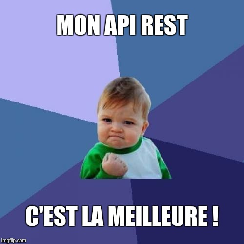
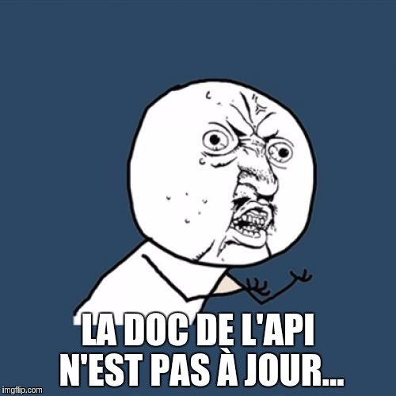
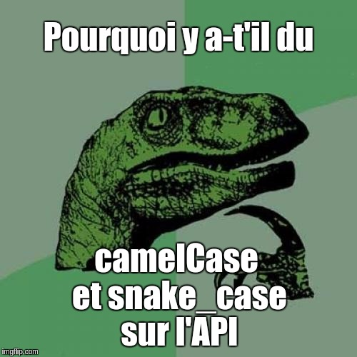
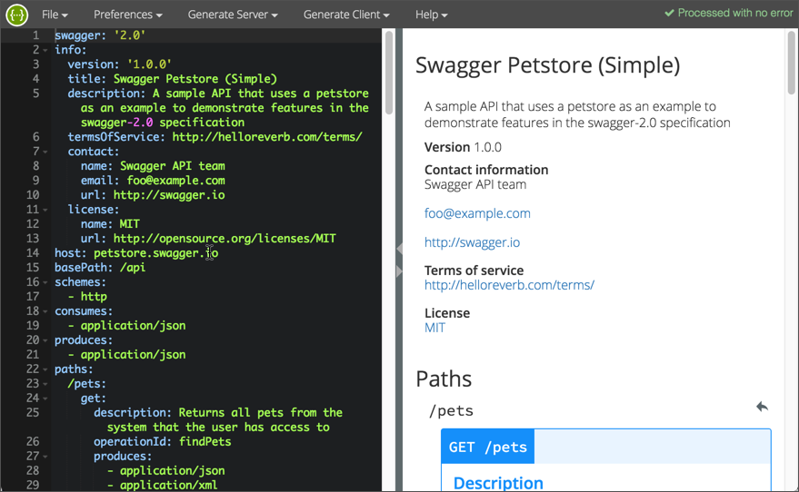
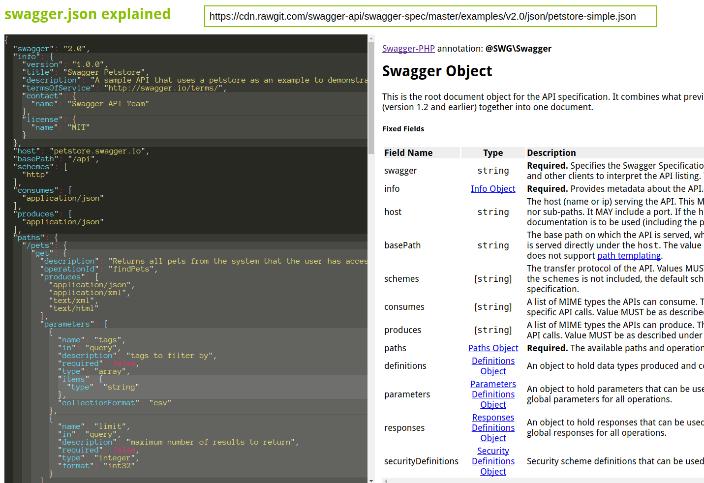
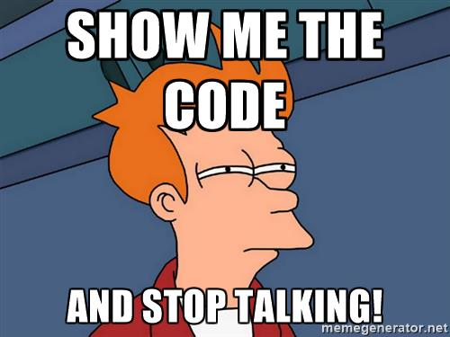

class: cover, center, bottom, white

# Présentation de Swagger
## Et de l'approche API First
### Et comment l'utiliser dans Symfony (ou autre)
#### Meetup Symfony Montpellier (juin 2017)

<a href="http://jeremybarthe.com/" target="_blank">Jérémy Barthe</a>

???
Cette photo illustre la rencontre entre une API et un client :)<br>
Qui développe des API ?<br>
Qui consome des API ?<br>
Qui code en Symfony ?<br>
Qui connait Swagger ?<br>

---

class: center, middle

# Jérémy Barthe

twitter.com/jeremyb_
twitter.com/afup_mtp
github.com/jeremyb

### TechMeetups.fr

[site]: http://jeremybarthe.com/
[talkspirit]: https://www.talkspirit.com/

@TODO: A designer

???
Symfony depuis 2009 / API depuis 2013<br>
Like approche framework agnostic / DDD<br>
talkSpirit / holaSpirit<br>
AFUP et membre de la team AFUP Mtp<br>
TechMeetups.fr + Communautés Mtp

---

class: center middle

# Let's Start a New API REST Project!

---

class: center middle


???
L'euphorie du début de projet<br>
Le code "a l'air" propre<br>
Recpect d'un standard<br>

---

class: center middle


http://media.topito.com/wp-content/uploads/2012/01/troll-face1.png

@TODO: ajouter Troll face

???
Troll<br>

---

class: center middle
# Et puis...

---

class: center middle


???
Evolution de l'API :<br>
C'est l'histoire d'un nouveau champ dans une resource de l'API qui est dispo à un endroit et pas à un autre

---

class: center middle


???
Si c'est pas, quelle doc ?

---

class: center middle


???
Problème de consistances<br>
Le standard n'est plus suivi<br>

---

class: center middle

# API first
## Design-first API development
### Documentation Driven Development

@TODO: lire : https://dzone.com/articles/design-first-or-code-first-whats-the-best-approach

???
Réfléchir à la spec de l'API avant de coder<br>
Définir un contrat d'API avant de coder<br>
Penser l'API comme si on allait la consommer<br>
Quelle requete HTTP pour quel résultat ?<br>
Quel status code est le plus adapté ?<br>
Permet de penser langage et framework agnostic<br>
Proche du TDD<br>

---

class: middle

# REST API specification formats

* [Swagger](http://swagger.io/) -> [OpenAPI Specification](https://www.openapis.org/)
* [API Blueprint](https://apiblueprint.org/)
* [RAML](http://raml.org/)
* [WSDL / WADSL](https://www.w3.org/TR/wsdl)

@TODO: lire : https://fr.slideshare.net/SmartBear_Software/api-strat-2014metadataformatsshort

---

class: middle

# Swagger / OpenAPI Specification

* Technologie agnostique de description d'API REST
* JSON ou YAML
* Open Source
* Version stable en cours Swagger 2.0 specification
* OpenAPI specification v3.0 en cours

@TODO: autre chose ?

---

class: center middle

# Swagger / OpenAPI Specification

> On Nov. 5, 2015, SmartBear in conjunction with 3Scale, Apigee, Capital One, 
> Google, IBM, Intuit, Microsoft, PayPal, and Restlet announced the formation of 
> the Open API Initiative, an open source project under the Linux Foundation.

> As part of the formation of the OAI, SmartBear donated the Swagger 
> specification to the Linux Foundation, meaning that the OpenAPI Specification 
> is semantically identical to the specification formerly known as the Swagger 
> 2.0 specification.

???
Quelques petites entreprises sont à l'origine de l'OpenAPI Specification<br><br>
OpenAPI specification 2.0 === Swagger 2.0 specification<br>

---

class: middle

# Ecosystème Swagger

* [Swagger.io](http://swagger.io/)
* Swagger UI (API console)
* Swagger Editor
* Swagger Codegen (générateur de code serveur et client)

???
Tout est disponible sur Github et Open Source<br>

---

class: middle
## Swagger UI


???
Documentation & console de test<br>
Pensez à activer CORS sur votre API (appel coté client => Cross-Origin Request)

---

class: middle
## Swagger Editor


---

class: middle

## Swagger codegen

* Développé en Java
* Simplifie la génération de server stubs et de client SDKs à partir d'un schéma Swagger

```bash
$ wget http://central.maven.org/maven2/io/swagger/swagger-codegen-cli/2.2.2/swagger-codegen-cli-2.2.2.jar -O swagger-codegen-cli.jar

$ java -jar swagger-codegen-cli.jar help

# Generate mock server in Silex
$ java -jar swagger-codegen-cli.jar generate \
   -i http://petstore.swagger.io/v2/swagger.json \
   -l silex-PHP \
   -o tmp/silex

# Generate SDK client   
$ java -jar swagger-codegen-cli.jar generate \   
   -i http://petstore.swagger.io/v2/swagger.json \
   -l typescript-angular2 \
   -o tmp/angular2
```

---

class: middle

# Ecosystème Swagger

* https://github.com/swagger-api/swagger-js SDK client
* https://github.com/swagger-api/validator-badge Swagger validator
* https://rebilly.github.io/ReDoc/ API Reference Documentation
* https://github.com/janephp/openapi
* Import dans Postman

@TODO: compléter cette slide

---

class: middle

# Swagger 2.0 specification

* General information about the API
* API resources (e.g. paths)
* HTTP methods
* Input (body, headers, path, query params)
* Output (body, headers)
* Schema (object definition / validation)
* Security (HTTP basic, API Keys, OAuth, JWT, etc.)

http://swagger.io/specification/

https://github.com/OAI/OpenAPI-Specification/blob/master/versions/2.0.md

---

## Décrire une API avec Swagger

```yaml
swagger: "2.0"
info:
  version: "1.0"
  title: "Hello World API"
paths:
  /hello/{user}:
    get:
      description: Returns a greeting to the user!
      parameters:
        - name: user
          in: path
          type: string
          required: true
          description: The name of the user to greet.
      responses:
        200:
          description: Returns the greeting.
          schema:
            type: string
        400:
          description: Invalid characters in "user" were provided.
```

---

## Structure du schéma Swagger

Field Name | Type | Description
---|:---:|---
swagger | `string` | **Required.** The value MUST be `"2.0"`.
info | `Info Object` | **Required.** Provides metadata about the API
host | `string` | The host (name or ip) serving the API.
basePath | `string` | The base path on which the API is served. 
schemes | [`string`] | The transfer protocol of the API.
consumes | [`string`] | A list of MIME types the APIs can consume.
produces | [`string`] | A list of MIME types the APIs can produce.
paths | `Paths Object` | **Required.** The available paths and operations for the API.
definitions | `Definitions Object` | An object to hold data types produced and consumed by operations.
securityDefinitions | `Security Definitions Object` | Security scheme definitions that can be used across the specification.
security | `Security Requirement Object` | A declaration of which security schemes are applied for the API as a whole.

---

## Data types

Common Name | `type` | `format` | Comments
----------- | ------ | -------- | --------
integer | `integer` | `int32` | signed 32 bits
long | `integer` | `int64` | signed 64 bits
float | `number` | `float` | |
double | `number` | `double` | |
string | `string` | | |
byte | `string` | `byte` | base64 encoded characters
binary | `string` | `binary` | any sequence of octets
boolean | `boolean` | | |
date | `string` | `date` | As defined by `full-date` - RFC3339
dateTime | `string` | `date-time` | As defined by `date-time` - RFC3339
password | `string` | `password` | Used to hint UIs the input needs to be obscured.

---

class: center middle



https://bfanger.nl/swagger-explained/

???
Documentation didactique

---

# JSON Schema

* Les definitions dans Swagger représentent une collection de Schema Object qui sont des JSON Schema

Primitive data types in the Swagger Specification are based on the types supported by the JSON-Schema Draft 4. Models are described using the Schema Object which is a subset of JSON Schema Draft 4.

> JSON Schema is a vocabulary that allows you to annotate and validate JSON documents.

JSON Schema Specification Draft 4

https://github.com/OAI/OpenAPI-Specification/blob/master/versions/2.0.md#schemaObject

http://json-schema.org/

@TODO: slide avec https://github.com/OAI/OpenAPI-Specification/blob/master/versions/2.0.md#schemaObject ?

???
Validation de structure de données JSON<br>
On va pouvoir utiliser ces validations dans le code du projet<br>
Ca rend d'autant plus intéressant le fait de commencer par les specs<br>
A savoir : quelques différences entre la spec JSON Schema et les definitions Swagger<br>

---

class: middle
## Intégration des JSON Schema dans Swagger

```yaml
swagger: "2.0"
...
paths: 
    post: 
      description: "Creates a new pet in the store."
      operationId: "addPet"
      produces: 
        - "application/json"
      parameters: 
        - 
          name: "pet"
          in: "body"
          description: "Pet to add to the store"
          required: true
          schema: 
            $ref: "#/definitions/NewPet"
      responses: 
        "200":
          description: "pet response"
          schema: 
            $ref: "#/definitions/Pet"
```

Source : https://github.com/OAI/OpenAPI-Specification/blob/master/examples/v2.0/yaml/petstore-simple.yaml

???
Les JSON Schema sont dans un noeud definitions

---

class: middle
## Exemple de JSON Schema

```yaml
NewPet: 
  type: "object"
  required: 
    - "name"
  properties: 
    name: 
      type: "string"
    tag: 
      type: "string"
```

---

class: center middle


---

class: middle

## JSON Schema en PHP

```bash
$ composer require justinrainbow/json-schema
# Using version ^5.2 for justinrainbow/json-schema
```

A PHP Implementation for validating JSON Structures against a given Schema.

---

class: middle

## JSON Schema en PHP

```php
$schemaStorage = new \JsonSchema\SchemaStorage();
$schemaStorage->addSchema(
    'file://petstore',
    json_decode(file_get_contents(...'/petstore-simple.json'))
);

$factory = new \JsonSchema\Constraints\Factory($schemaStorage);
$jsonValidator = new \JsonSchema\Validator($factory);

$jsonValidator->check(
    json_decode('{"name": "Garfield", "tag": "miaou"}'),
    (object) ['$ref' => 'file://petstore#/definitions/NewPet']
);

var_dump($jsonValidator->isValid()); // true
var_dump($jsonValidator->getErrors()); // []
```

---

class: middle

## JSON Schema en PHP

```php
// ...

$jsonValidator->check(
    json_decode('{"data": "I\'m Hacker"}'),
    (object) ['$ref' => 'file://petstore#/definitions/NewPet']
);

var_dump($jsonValidator->isValid()); // false
var_dump($jsonValidator->getErrors()); 
// [
//     {
//         "property":"name",
//         "pointer":"\/name",
//         "message":"The property name is required",
//         "constraint":"required"
//     }
// ]
```

---

class: center middle


---

class: center middle

# Avec Symfony
--

### There is a Bundle for that...
--

### Ou pas !

---

Référencer les bundles Symfony (et leur défauts ?)

* SwaggerBundle
* rezza

@TODO: lister les bundles

???
Pas de bundle mais c'est très facile d'arriver au résultat<br>

---

class: middle
## Avec Symfony

A Symfony event listener for decoding JSON encoded request content.

```bash
$ composer require qandidate/symfony-json-request-transformer
```

```yaml
# app/config/services.yml
Qandidate\Common\Symfony\HttpKernel\EventListener\JsonRequestTransformerListener:
    tags:
        - { name: kernel.event_listener, event: kernel.request, method: onKernelRequest, priority: 100 }
```

Juste 1 classe ! :)

???
Lib très simple (seulement 1 classe) vous pouvez la ré-implémenter si vous le souhaitez<br>
Transforme la Request Symfony à partir d'une requete avec Content-type: application/json<br>
Pour ne pas utiliser FOSRestBundle juste pour faire cette transformation<br>

---

class: middle
## Avec Symfony

Enregistrer la spécification Swagger dans le container Symfony :

```php
class AppKernel extends Kernel
{
    // ...
    
    protected function build(ContainerBuilder $container)
    {
        $container->setParameter(
            'swagger_spec',
            json_encode(
                Yaml::parse(file_get_contents(__DIR__.'/config/swagger.yml'))
            )
        );
    }
    
    // ...
}
```

---

class: middle
## Avec Symfony

Exposer la spécification Swagger en JSON :

```php
/**
 * @Route("/swagger.json")
 */
public function __invoke() : Response
{
    return Response::create(
        $this->getParameter('swagger_spec'),
        Response::HTTP_OK,
        ['Content-Type' => 'application/json']
    );
}
```

???
Une action pour exposer la spécification Swagger en JSON<br>

---

class: middle
## Avec Symfony : service JSON Validator

```php
use JsonSchema\Constraints\Factory;
use JsonSchema\SchemaStorage;
use JsonSchema\Validator;

final class JsonValidatorFactory
{
    public static function create(string $swaggerSpec) : Validator
    {
        $schemaStorage = new SchemaStorage();
        $schemaStorage->addSchema('file://petstore', json_decode($swaggerSpec));

        return new Validator(new Factory($schemaStorage));
    }
}
```

```yaml
# app/config/services.yml
    JsonSchema\Validator:
        factory: ['AppBundle\Rest\JsonValidatorFactory', create]
        arguments: ['%swagger_spec%']
        public: true
```

---

class: middle
## Avec Symfony : action NewPet

```php
final class PetsController extends Controller
{
    public function __invoke(Request $request) : Response
    {
        $newPet = $request->request->all();

        $jsonValidator = $this->get(Validator::class);
        $jsonValidator->check(
            (object) $newPet,
            (object) ['$ref' => 'file://petstore#/definitions/NewPet']
        );

        if (!$jsonValidator->isValid()) {
            return JsonResponse::create(
                $jsonValidator->getErrors(),
                Response::HTTP_BAD_REQUEST
            );
        }

        return JsonResponse::create([
            'id' => random_int(1, PHP_INT_MAX),
            'name' => $newPet['name'],
            'tag' => $newPet['tag'],
        ]);
    }
}
```

???
@TODO: changer check() par validate() ?

---

class: middle

```bash
➜  ~ http POST http://127.0.0.1:8000/pets name=Garfield tag=miaou

HTTP/1.1 200 OK
Content-Type: application/json

{
    "id": 741148193246254611, 
    "name": "Garfield", 
    "tag": "miaou"
}
```

```bash
➜  ~ http POST http://127.0.0.1:8000/pets test=error             

HTTP/1.1 400 Bad Request
Content-Type: application/json

[
    {
        "constraint": "required", 
        "context": 1, 
        "message": "The property name is required", 
        "pointer": "/name", 
        "property": "name"
    }
]
```

???
https://httpie.org/ c'est bien pratique<br>

---

class: center middle


---

## Avec Symfony : tests fonctionnels

```php
class PetsControllerTest extends WebTestCase
{
    /**
     * @test
     */
    public function it_should_create_a_new_pet()
    {
        $client = static::createClient();
        $client->request(
            'POST',
            '/pets',
            [],
            [],
            ['CONTENT_TYPE' => 'application/json'],
            json_encode(['name' => 'Garfield', 'tag' => 'miaou'])
        );
        Assert::assertEquals(Response::HTTP_OK, $client->getResponse()->getStatusCode());

        $jsonValidator = $client->getContainer()->get(Validator::class);
        $jsonValidator->reset();
        $jsonValidator->check(
            json_decode($client->getResponse()->getContent()),
            (object) ['$ref' => 'file://petstore#/definitions/Pet']
        );
        Assert::assertTrue($jsonValidator->isValid(), dump($jsonValidator->getErrors()));
    }
}
```

???
Anecdote : avec JMS Serializer object JSON transformé en array...

---

## Avec Symfony : tests fonctionnels

```php
/**
 * @test
 */
public function it_should_handle_error_when_creating_a_new_pet()
{
    $client = static::createClient();
    $client->request(
        'POST',
        '/pets',
        [],
        [],
        ['Content-type' => 'application/json'],
        json_encode(['wrong' => 'data'])
    );
    Assert::assertEquals(Response::HTTP_BAD_REQUEST, $client->getResponse()->getStatusCode());

    $jsonValidator = $client->getContainer()->get(Validator::class);
    $jsonValidator->reset();
    $jsonValidator->check(
        json_decode($client->getResponse()->getContent()),
        (object) ['$ref' => 'file://petstore#/definitions/ErrorModel']
    );
    Assert::assertTrue($jsonValidator->isValid(), dump($jsonValidator->getErrors()));
}
```

???
Ce test plante car je n'ai pas suivi la définition ErrorModel :)

---

class: middle
# REX sur un projet en cours

* Symfony
* `justinrainbow/json-schema`
* NelmioCorsBundle

<dl>
  <dt><code>JsonBodyListener</code></dt>
  <dd>traiter les requêtes en JSON et valider avec les JSON Schema (exception <code>InvalidPayload</code>)</dd>
  <dt><code>JsonExceptionListener</code></dt>
  <dd>pour convertir des exceptions en JSON</dd>
  <dt>Config <code>twig.exception_controller</code></dt>
  <dd>pour convertir les erreurs Symfony en JSON</dd>
  <dt><code>ApiTestCase</code></dt>
  <dd>pour les test fonctionnels (exemple de méthode <code>validateResponse</code>)</dd>
</dl>

---

class: center middle
# Merci !
## Questions ?

[jeremybarthe.com][site] - [Twitter][twitter] - [Github][github]

[site]: http://jeremybarthe.com/
[twitter]: https://twitter.com/jeremyb_
[github]: https://github.com/jeremyb

---

Tutorial 

https://apihandyman.io/writing-openapi-swagger-specification-tutorial-part-1-introduction/

http://idratherbewriting.com/learnapidoc/pubapis_swagger_intro.html
http://idratherbewriting.com/learnapidoc/pubapis_swagger.html

https://blog.runscope.com/posts/openapi-swagger-resource-list-for-api-developers?format=amp

@TODO: lire : http://nordicapis.com/difference-api-documentation-specification-definition/
