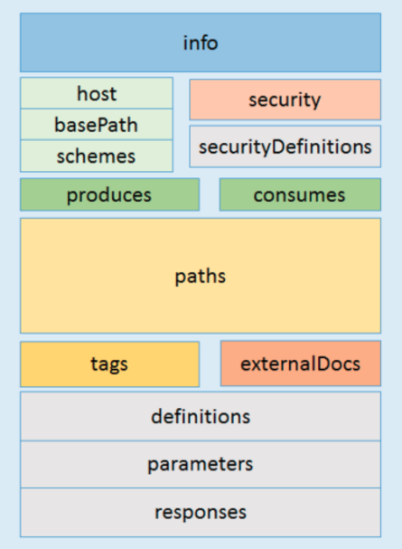

class: cover, center, bottom, white

# Présentation de Swagger
### Et comment l'utiliser dans Symfony (ou autre)
#### Meetup Symfony Montpellier (juin 2017)

<a href="http://jeremybarthe.com/" target="_blank">Jérémy Barthe</a>

???
* Cette photo illustre la rencontre entre une API et un client :)
* Qui développe des API ?
* Qui consomme des API ?
* Qui code en Symfony ?
* Qui connait Swagger ?

---

class: profile, middle

# Jérémy Barthe


* [@jeremyb_](https://twitter.com/jeremyb_)
* [github.com/jeremyb](https://github.com/jeremyb)
* [@Afup_Mtp](https://twitter.com/Afup_Mtp)
* [holaspirit.com](https://www.holaspirit.com/)

### [TechMeetups.fr](http://techmeetups.fr/)
### [Slack comm-montpellier](https://comm-montpellier-invit.herokuapp.com/)

???
* Développement Symfony + API REST depuis environ 3 ans
* holaSpirit : nouveaux modes de gouvernance
* Adhérent AFUP et membre de la team AFUP Mtp
* TechMeetups.fr + Slack Communautés Mtp (Venez !)

---

class: center middle

# Let's Start a New API REST Project!

???
* C'est parti pour le développement d'un nouveau projet !
* L'euphorie du début de projet

---

class: center middle


???
* Le code "a l'air" propre
* Bien designé ses ressources
* Respect d'un standard (HAL, JSON-API, JSON-LD)
* Peut-etre meme HATEOAS ? 

---

class: center middle troll-face


???
* FOSRestBundle
* JMS Serializer
* NelmioApiDocBundle
* HateoasBundle
* RestExtraBundle
* Troll

---

class: center middle
# Et puis...

???
* Cycle de vie classique d'un projet...

---

class: center middle


???
* Evolution de l'API
* C'est l'histoire d'un nouveau champ dans une resource de l'API qui est dispo à un endroit et pas à un autre

---

class: center middle


???
* Si c'est pas, quelle doc ?

---

class: center middle


???
* Problème de consistances
* Pas les mêmes format I/O
* Le standard n'est plus suivi

---

class: center middle

# Design-first API development
### Documentation Driven Development

???
* Réfléchir à la spec avant de coder / TDD ?
* Penser l'API comme si on allait la consommer
* Quelle requete HTTP / status code pour quel résultat ?
* Langage & framework agnostic

---

class: middle

# REST API specification formats

* [Swagger](http://swagger.io/) -> [OpenAPI Specification](https://www.openapis.org/)
* [API Blueprint](https://apiblueprint.org/)
* [RAML](http://raml.org/)
* [WSDL / WADSL](https://www.w3.org/TR/wsdl)

???
* Swagger : JSON ou YAML
* API Blueprint : Markdown
* RAML : YAML
* WSDL / WADSL : XML

---

class: middle

# Swagger / OpenAPI

* Technologie agnostique de description d'API REST
* Format JSON ou YAML
* Open Source
* Version en cours Swagger 2.0 specification
* Future : OpenAPI specification v3.0

???
* Agnostique (vous pouvez le placer en dehors de votre code)
* Fichier JSON ou YAML (plus facile à éditer)
* Open Source
* Grosse adoption, beaucoup de tools, communauté active

---

class: middle

# Swagger / OpenAPI

> On Nov. 5, 2015, SmartBear in conjunction with 3Scale, Apigee, Capital One, 
> Google, IBM, Intuit, Microsoft, PayPal, and Restlet announced the formation of 
> the Open API Initiative, an open source project under the Linux Foundation.

> As part of the formation of the OAI, SmartBear donated the Swagger 
> specification to the Linux Foundation, meaning that the OpenAPI Specification 
> is semantically identical to the specification formerly known as the Swagger 
> 2.0 specification.

???
* Quelques petites entreprises sont à l'origine de l'OpenAPI Specification
* Standard et largement adopté
* OpenAPI 2.0 === Swagger 2.0

---

class: center middle
# Swagger 2.0 specification

???
* La spec maintenant !

---

class: center middle

## Swagger 2.0 specification



La spec complète : http://swagger.io/specification/

???
* API resources (e.g. paths)
* HTTP methods
* Input (body, headers, path, query params)
* Output (body, headers)
* Definitions : Schema Object = validation
* Security

---

class: center middle


https://bfanger.nl/swagger-explained/

???
* Documentation didactique

---

class: middle

## Décrire une API avec Swagger

```yaml
swagger: "2.0"
info:
  version: "1.0"
  title: "Hello World API"
paths:
  /hello/{user}:
    get:
      description: Returns a greeting to the user!
      parameters:
        - name: user
          in: path
          type: string
          required: true
          description: The name of the user to greet.
      responses:
        200:
          description: Returns the greeting.
          schema:
            type: string
        400:
          description: Invalid characters in "user" were provided.
```

---

class: center middle

# Schema Object / JSON Schema

> The Schema Object allows the definition of input and output data types. (...)
> This object is based on the JSON Schema Specification Draft 4 and uses a predefined subset of it.

[Spécification des Schema Object](https://github.com/OAI/OpenAPI-Specification/blob/master/versions/2.0.md#schemaObject)

> JSON schema defines a JSON based format for defining the structure of JSON data.

Source : http://json-schema.org/

???
* Validation de structure de données JSON
* Utilisation des validations dans le code
* Intéret de commencer par les specs !
* A savoir : quelques différences JSON Schema et Schema Object

---

class: middle
## Intégration des JSON Schema dans Swagger

```yaml
swagger: "2.0"
...
paths: 
    post: 
      description: "Creates a new pet in the store."
      operationId: "addPet"
      produces: 
        - "application/json"
      parameters: 
        - 
          name: "pet"
          in: "body"
          description: "Pet to add to the store"
          required: true
          schema: 
            $ref: "#/definitions/NewPet"
      responses: 
        "200":
          description: "pet response"
          schema: 
            $ref: "#/definitions/Pet"
```

Source : [petstore-simple.yaml](https://github.com/OAI/OpenAPI-Specification/blob/master/examples/v2.0/yaml/petstore-simple.yaml)

???
* Les JSON Schema sont dans un noeud definitions

---

class: middle
## Exemple de JSON Schema

```yaml
definitions:
  NewPet: 
    type: "object"
    required: 
      - "name"
    properties: 
      name: 
        type: "string"
      tag: 
        type: "string"
```

---

class: middle
## Exemple de JSON Schema

```yaml
definitions:
  User:
    type: object
    additionalProperties: false
    description: User
    required:
      - name
    properties:
      name:
        type: string
      address:
        type: array
        items:
          "$ref": "#/definitions/Address"
  Address:
    type: object
    additionalProperties: false
    description: Address
    properties:
      type:
        type: string
        enum:
          - home
          - office
      line1:
        type: string
```

---

## Data types

* integer : `integer` (32 bits)
* long : `integer` (64 bits)
* float : `number`
* double : `number`
* string : `string`
* byte : `string` (base64 encoded)
* binary : `string` (any sequence of octets)
* boolean : `boolean`
* date : `string` (RFC3339: `Y-m-d`)
* dateTime : `string` (RFC3339: `Y-m-d\TH:i:sP`)
* password : `string` (uniquement pour l'UI)

---

class: center middle


---

class: middle

## JSON Schema en PHP

```bash
$ composer require justinrainbow/json-schema
# Using version ^5.2 for justinrainbow/json-schema
```

A PHP Implementation for validating JSON Structures against a given Schema.

---

class: middle

## JSON Schema en PHP

```php
$schemaStorage = new \JsonSchema\SchemaStorage();
$schemaStorage->addSchema(
    'file://petstore',
    json_decode(file_get_contents(...'/petstore-simple.json'))
);

$factory = new \JsonSchema\Constraints\Factory($schemaStorage);
$jsonValidator = new \JsonSchema\Validator($factory);

$jsonValidator->check(
    json_decode('{"name": "Garfield", "tag": "miaou"}'),
    (object) ['$ref' => 'file://petstore#/definitions/NewPet']
);

var_dump($jsonValidator->isValid()); // true
var_dump($jsonValidator->getErrors()); // []
```

---

class: middle

## JSON Schema en PHP

```php
// ...

$jsonValidator->check(
    json_decode('{"data": "I\'m Hacker"}'),
    (object) ['$ref' => 'file://petstore#/definitions/NewPet']
);

var_dump($jsonValidator->isValid()); // false
var_dump($jsonValidator->getErrors()); 
// [
//     {
//         "property":"name",
//         "pointer":"\/name",
//         "message":"The property name is required",
//         "constraint":"required"
//     }
// ]
```

???
* C'est cool d'avoir une erreur aussi détaillée
* Prête à être exposée au client
* Rappel pour ceux qui ont fait des API Rest avec les Symfony Forms

---

class: center middle


---

class: center middle

# Avec Symfony
--

### There is a Bundle for that...
--

### Ou pas !

---

class: middle

# Les bundles / libs

* [Nicofuma/SwaggerBundle](https://github.com/Nicofuma/SwaggerBundle)
* [zircote/swagger-php](https://github.com/zircote/swagger-php)
* [symfony-json-rest-api](https://github.com/rezzza/symfony-json-rest-api)
* etc. ?

???
* SwaggerBundle: dépend de PHPUnit (34 nouvelles deps)
* swagger-php: annotations dans le code... on perd le Design-first
* symfony-json-rest-api: super lib mais pas facilement utilisable avec Swagger

---

class: middle
## Avec Symfony

Enregistrer la spécification Swagger dans le container Symfony :

```php
class AppKernel extends Kernel
{
    // ...
    
    protected function build(ContainerBuilder $container)
    {
        $container->setParameter(
            'swagger_spec',
            json_encode(
                Yaml::parse(file_get_contents(__DIR__.'/config/swagger.yml'))
            )
        );
    }
    
    // ...
}
```

---

class: middle
## Avec Symfony

Exposer la spécification Swagger en JSON :

```php
/**
 * @Route("/swagger.json")
 */
public function __invoke() : Response
{
    return Response::create(
        $this->getParameter('swagger_spec'),
        Response::HTTP_OK,
        ['Content-Type' => 'application/json']
    );
}
```

???
* Une action pour exposer la spécification Swagger en JSON

---

class: middle
## Avec Symfony : service JSON Validator

```php
use JsonSchema\Constraints\Factory;
use JsonSchema\SchemaStorage;
use JsonSchema\Validator;

final class JsonValidatorFactory
{
    public static function create(string $swaggerSpec) : Validator
    {
        $schemaStorage = new SchemaStorage();
        $schemaStorage->addSchema('file://petstore', json_decode($swaggerSpec));

        return new Validator(new Factory($schemaStorage));
    }
}
```

```yaml
# app/config/services.yml
    JsonSchema\Validator:
        factory: ['AppBundle\Rest\JsonValidatorFactory', create]
        arguments: ['%swagger_spec%']
        public: true
```

???
* Service version Symfony 3.3 (attention au public)

---

class: middle
## Avec Symfony : action NewPet

```php
final class PetsController extends Controller
{
    public function __invoke(Request $request) : Response
    {
        $newPet = $request->request->all();

        $jsonValidator = $this->get(Validator::class);
        $jsonValidator->check(
            (object) $newPet,
            (object) ['$ref' => 'file://petstore#/definitions/NewPet']
        );

        if (!$jsonValidator->isValid()) {
            return JsonResponse::create(
                $jsonValidator->getErrors(),
                Response::HTTP_BAD_REQUEST
            );
        }

        return JsonResponse::create([
            'id' => random_int(1, PHP_INT_MAX),
            'name' => $newPet['name'],
            'tag' => $newPet['tag'],
        ]);
    }
}
```

---

class: middle
## Avec Symfony : requête JSON

Un listener sur le Kernel pour décoder le contenu JSON d'une requête HTTP.

```bash
$ composer require qandidate/symfony-json-request-transformer
```

```yaml
# app/config/services.yml
Qandidate\Common\Symfony\HttpKernel\EventListener\JsonRequestTransformerListener:
    tags:
        - { name: kernel.event_listener, event: kernel.request, method: onKernelRequest, priority: 100 }
```

???
* Seulement 1 classe !
* Transforme la Request Symfony (Content-type: application/json)
* Pour ne pas utiliser FOSRestBundle juste pour faire cette transformation

---

class: middle

```bash
➜  ~ http POST http://127.0.0.1:8000/pets name=Garfield tag=miaou

HTTP/1.1 200 OK
Content-Type: application/json

{
    "id": 741148193246254611, 
    "name": "Garfield", 
    "tag": "miaou"
}
```

```bash
➜  ~ http POST http://127.0.0.1:8000/pets test=error             

HTTP/1.1 400 Bad Request
Content-Type: application/json

[
    {
        "constraint": "required", 
        "context": 1, 
        "message": "The property name is required", 
        "pointer": "/name", 
        "property": "name"
    }
]
```

???
* https://httpie.org/ c'est bien pratique

---

class: center middle


???
* Anecdote : avec JMS Serializer object JSON transformé en array...

---

## Avec Symfony : tests fonctionnels

```php
class PetsControllerTest extends WebTestCase
{
    /**
     * @test
     */
    public function it_should_create_a_new_pet()
    {
        $client = static::createClient();
        $client->request(
            'POST',
            '/pets',
            [],
            [],
            ['CONTENT_TYPE' => 'application/json'],
            json_encode(['name' => 'Garfield', 'tag' => 'miaou'])
        );
        Assert::assertEquals(Response::HTTP_OK, $client->getResponse()->getStatusCode());

        $jsonValidator = $client->getContainer()->get(Validator::class);
        $jsonValidator->reset();
        $jsonValidator->check(
            json_decode($client->getResponse()->getContent()),
            (object) ['$ref' => 'file://petstore#/definitions/Pet']
        );
        Assert::assertTrue($jsonValidator->isValid(), dump($jsonValidator->getErrors()));
    }
}
```

---

## Avec Symfony : tests fonctionnels

```php
/**
 * @test
 */
public function it_should_handle_error_when_creating_a_new_pet()
{
    $client = static::createClient();
    $client->request(
        'POST',
        '/pets',
        [],
        [],
        ['Content-type' => 'application/json'],
        json_encode(['wrong' => 'data'])
    );
    Assert::assertEquals(Response::HTTP_BAD_REQUEST, $client->getResponse()->getStatusCode());

    $jsonValidator = $client->getContainer()->get(Validator::class);
    $jsonValidator->reset();
    $jsonValidator->check(
        json_decode($client->getResponse()->getContent()),
        (object) ['$ref' => 'file://petstore#/definitions/ErrorModel']
    );
    Assert::assertTrue($jsonValidator->isValid(), dump($jsonValidator->getErrors()));
}
```

???
Ce test plante car je n'ai pas suivi la définition ErrorModel :)

---

class: center middle
# Last but not least
### Communauté / Ecosystème

---

class: middle

# Ecosystème Swagger

* Swagger UI (API console)
* Swagger Editor
* Swagger Codegen (générateur de code serveur et client)

???
* Swagger UI : API console
* Swagger Codegen : générateur de code serveur et client
* Tout est disponible sur Github et Open Source

---

class: middle
## Swagger UI


???
* Documentation & console de test
* Pensez à activer CORS sur votre API (Cross-Origin Request)

---

class: middle
## Swagger Editor


---

class: middle

## Swagger codegen

* Développé en Java
* Simplifie la génération de server stubs et de client SDKs à partir d'un schéma Swagger

```bash
$ wget http://central.maven.org/maven2/io/swagger/swagger-codegen-cli/2.2.2/swagger-codegen-cli-2.2.2.jar -O swagger-codegen-cli.jar

$ java -jar swagger-codegen-cli.jar help

# Generate mock server in Silex
$ java -jar swagger-codegen-cli.jar generate \
   -i http://petstore.swagger.io/v2/swagger.json \
   -l silex-PHP \
   -o tmp/silex

# Generate SDK client
$ java -jar swagger-codegen-cli.jar generate \
   -i http://petstore.swagger.io/v2/swagger.json \
   -l typescript-angular2 \
   -o tmp/angular2
```

---

class: middle

# Ecosystème Swagger

Libs :

* [swagger-api/swagger-js](https://github.com/swagger-api/swagger-js)
* [swagger-api/validator-badge](https://github.com/swagger-api/validator-badge)
* [janephp/openapi](https://github.com/janephp/openapi)
* Import de la spécification Swagger dans Postman !

???
* swagger-js : Javascript client HTTP
* validator-badge : Validation du fichier Swagger JSON/YAML
* Jane Open Api : PHP Client API (PSR7 compatible) (exemple de docker-php basé sur Swagger)

---

class: middle

# Ecosystème Swagger

Génération de documentation HTML

* [ReDoc](https://github.com/Rebilly/ReDoc)
* [Spectacle](https://sourcey.com/spectacle/)

Et bien d'autres outils et intégrations :<br>
http://swagger.io/open-source-integrations/

---

class: middle
# REX sur un projet en cours

* Symfony
* `justinrainbow/json-schema`
* NelmioCorsBundle


* <code>JsonBodyListener</code>
* <code>JsonExceptionListener</code>
* Config <code>twig.exception_controller</code>
* <code>ApiTestCase</code>

???
* JsonBodyListener: requêtes en JSON + JSON Schema
* JsonExceptionListener : convertir des exceptions en JSON
* twig.exception_controller : pour convertir les erreurs Symfony en JSON
* ApiTestCase : tests fonctionnels (ex : <code>validateResponse</code>)

---

class: center middle

# Défauts ?
### Ou plutôt à savoir

* Validation limitée au JSON Schema
* Ecosystème Symfony

???
* Exemple inscription (email unique ou champ dépendant)

---

class: center middle
# Merci !
## Questions ?

[jeremybarthe.com][site] - [Twitter][twitter] - [Github][github]

[site]: http://jeremybarthe.com/
[twitter]: https://twitter.com/jeremyb_
[github]: https://github.com/jeremyb

---

class: center middle
## Aller plus loin

* https://apihandyman.io/writing-openapi-swagger-specification-tutorial-part-1-introduction/
* http://idratherbewriting.com/learnapidoc/pubapis_swagger_intro.html
* https://blog.runscope.com/posts/openapi-swagger-resource-list-for-api-developers?format=amp
